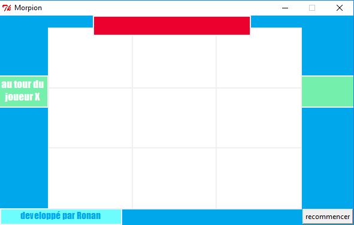

<!DOCTYPE html>
<html>

<head>
  <meta charset="utf-8">
  <meta name="viewport" content="width=device-width, initial-scale=1.0">
  <title>Welcome file</title>
  <link rel="stylesheet" href="https://stackedit.io/style.css" />
</head>

<body class="stackedit">
  
<h1 id="jeu-du-morpion">Jeu du morpion</h1>
<h2 id="fonctionnalités">Fonctionnalités</h2>
<ul>
<li>Morpion à deux joueur chacun son tour (Morpion)</li>
<li>Morpion contre un ordinateur (Morpion-ia)</li>
<li>Utilisation de python et du module Tkinter.</li>
</ul>
<h1 id="morpion">Morpion</h1>

Le jeu se joue avec le clic gauche de la souris. 

<h1 id="morpion-ia">Morpion-ia</h1>

</body>

</html>
