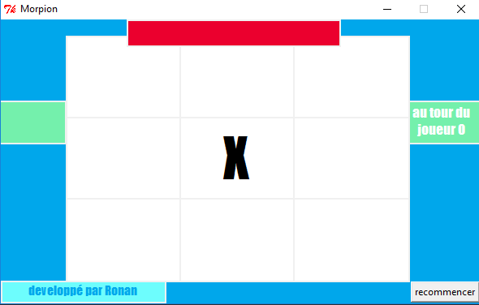
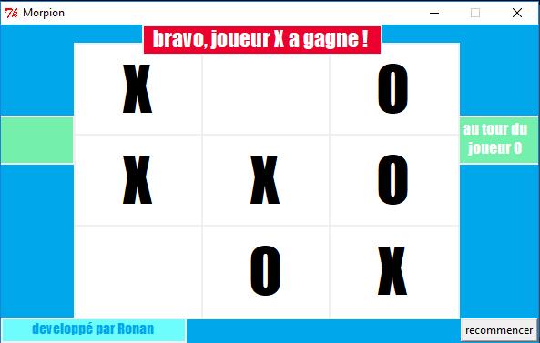
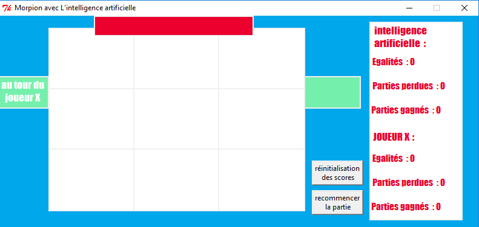
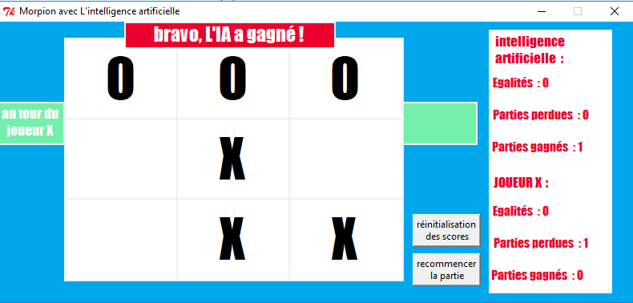

<!DOCTYPE html>
<html>

<head>
  <meta charset="utf-8">
  <meta name="viewport" content="width=device-width, initial-scale=1.0">
  <link rel="stylesheet" href="https://stackedit.io/style.css" />
</head>

<body class="stackedit">
 
      
<ul>
<li><a href="#jeu-du-morpion">Jeu du morpion</a>
<ul>
<li><a href="#fonctionnalités">Fonctionnalités</a></li>
</ul>
</li>
<li><a href="#morpion">Morpion</a></li>
<li><a href="#morpion-ia">Morpion-ia</a></li>
</ul>

    
  

  

    

      <h1 id="jeu-du-morpion">Jeu du morpion</h1>
 

    

<h2 id="fonctionnalités">Fonctionnalités</h2>
<ul>
<li>

Morpion à deux joueur chacun son tour (Morpion)

</li>
<li>

Morpion contre un ordinateur (Morpion-ia)

</li>
<li>

Utilisation de python et du module Tkinter.

</li>
</ul>
<h1 id="morpion">Morpion</h1>

Le jeu se joue avec le clic gauche de la souris.

Lorsqu’on clique sur une case, l’autre joueur est invité à cliquer et à jouer.

Pour finir, quand un joueur gagne, le jeu s’arrête avec le message du joueur gagnant et le jeu peut recommencer grâce au bouton “recommencer”.

<h1 id="morpion-ia">Morpion-ia</h1>

Il y a des statistiques de jeu et un bouton pour réinitialiser les scores et un autre pour redémarrer le jeu.

Et lorsqu’on clique sur une case, l’ordinateur joue pour essayer de gagner contre vous.

    
  

</body>

</html>
